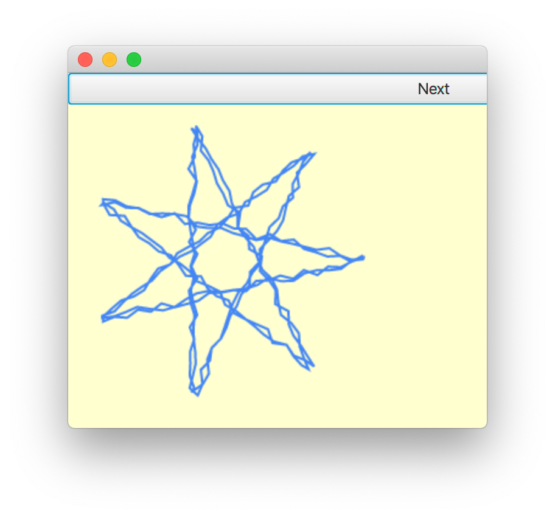

# JFXToolsAndDemos

A collection of tools and demos for JavaFX.

## Build

From the top-level project directory call:

```
mvn clean install
```

## Modules

### JARProcessor

A simple tool to analyze and process jar files. Currently two processors are implemented.

#### Module checker

This jar-processor analyzes a list of jar-files and lists all services provided
by the contained code.

It further checks whether the contained code is modular or non-modular. If it is
modular, it checks if the service delarations for the module-path are consistent
with the declarations for the classpath.

Example:

```
mvn exec:java -pl jfxtools-jarprocessor -Dexec.args="ModuleChecker -v module1.jar module2.jar ..."
```

#### FXML checker

This jar-processor analyzes a list of jar-files and lists all FXML files
contained in each file.

It further examines all import statements of the FXML files and finally
prints out a combined list of all classes loaded by all the jar files.
This is useful for tools like the maven shade plugin, ProGuard of GluonHQs
client-maven-plugin for which you have to provide a list of all classes
which have to be kept but which cannot be found by static analysis of the
code.

Example:

```
mvn exec:java -pl jfxtools-jarprocessor -Dexec.args="FXMLChecker -v -n module1.jar module2.jar ..."
```

#### Native artifact checker

This jar-processor analyzes a list of jar-files and lists all native artifacts
contained in each file. All files which end with ".o", ".a", ".so", ".dll", ".dylib"
or ".jnilib" are listed.

This is useful to know if you want to strip unneeded files from a build or if you want
to check if all native artifacts in your build have been properly signed. This is, e.g,
necessary to get a bundled app notarized by Apple.

Example:

```
mvn exec:java -pl jfxtools-jarprocessor -Dexec.args="NativeArtifactChecker -v module1.jar module2.jar ..."
```

### VLCJFXVideoPlayer

This is a very simple example of a video player which uses the new WritableImage
of JavaFX 13 with support for Buffers to improve performance. The idea is to let the
well known [VLC media player](http://www.videolan.org/vlc/), which can play almost
everything you throw at it, directly render into
this buffer and use the image directly in an ImageView without any explicit rendering
into a canvas or such thing. Only this brings the desired performance boost.

What I have not considered yet is any kind of synchronization.
I think an extension of the PixelBuffer to support some kind of double-buffering
would be the right thing to do.

In order to run the code, a recent version of the VLC player (3.0.x+) must be installed
in a standard location on the system.

This should work on macOS and Linux but there currently seem to be problems with the VLC code
itself on Windows. Tested on macOS 10.14.6 and Linux.

This software is based on the [VLCJ project](https://github.com/caprica/vlcj).
Other dependencies can be found in the pom.xml.

#### Run

From the top-level project directory call:

```
mvn exec:java@vlcjfx-demo1 -pl jfxtools-vlcjfx-demos
```

or

```
mvn exec:java@vlcjfx-demo2 -pl jfxtools-vlcjfx-demos
```

### AWTImage

A simple wrapper arround an AWT image which utilizes the new WritableImage
of JavaFX 13 with support for Buffers. Internally a JavaFX image is created
which directly uses the same memory as the AWT image. So if you render
into the AWT image with a AWT graphics context, the result will immediately
appear on the screen.

#### Run

There are three examples for AWTImage. The first one just does some drawing and demonstrates the update behaviour
and the second and third one utilizes AWTImage to build a little JavaFX PDF viewer based on Apache PDFBox.

From the top-level project directory call:

```
mvn exec:java@AWTImageDemo -pl jfxtools-awtimage-demos
```

or

```
mvn exec:java@PDFViewerDemo -pl jfxtools-awtimage-demos
```

or

```
mvn exec:java@PDFViewerDemo2 -pl jfxtools-awtimage-demos
```

### NativeRenderingCanvas

An example to show how some native renderer can be integrated seemlessly into JavaFX.
It uses the new WritableImage of JavaFX 13 with support for Buffers to improve performance.

For more details see: [NativeRenderingCanvas](jfxtools-canvas/docs/NativeRenderingCanvas.adoc)

**Attention 1: The event-handling in this example currently only works with JDK 11 and JFX 13+.**
See [JDK-8236971](https://bugs.openjdk.java.net/browse/JDK-8236971).

**Attention 2: Building the native part on anything else but macOS is completely untested.**
**Building the native part on Windows requires MinGW.**

#### Run

From the top-level project directory call:

```
mvn -pl jfxtools-canvas-demos exec:exec
```

### SkiaSurfaceFX

This is a simple example of a wrapper for the Skia rendering engine. It uses the new WritableImage
of JavaFX 13 with support for Buffers to improve performance. The idea is to let [Skia](https://skia.org/)
directly render into this buffer and use the image directly in an ImageView without any explicit rendering
into a canvas or such thing. Only this brings the desired performance boost. This code makes use
of the [Skija](https://github.com/JetBrains/skija) java bindings provided by JetBrains.



#### Run

From the top-level project directory call:

```
mvn exec:java@SkiaSurfaceFXDemo1 -pl jfxtools-skiafx-demos
```


