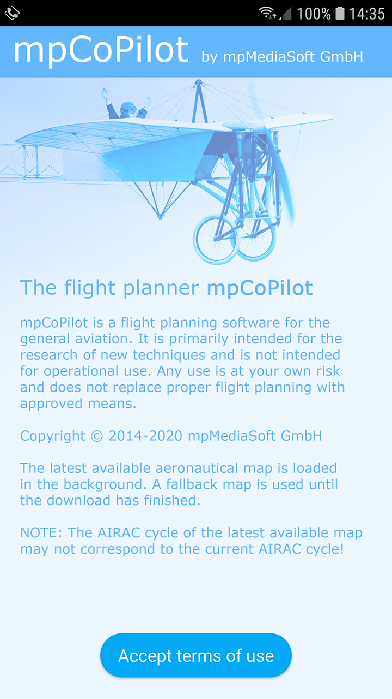
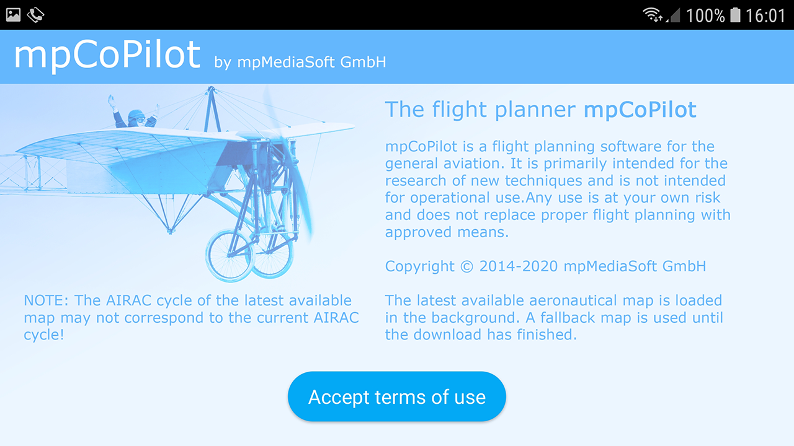
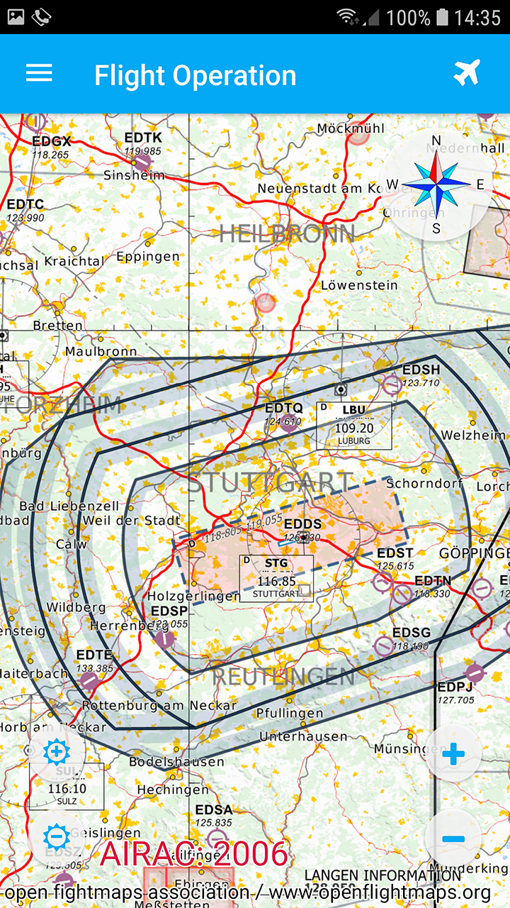
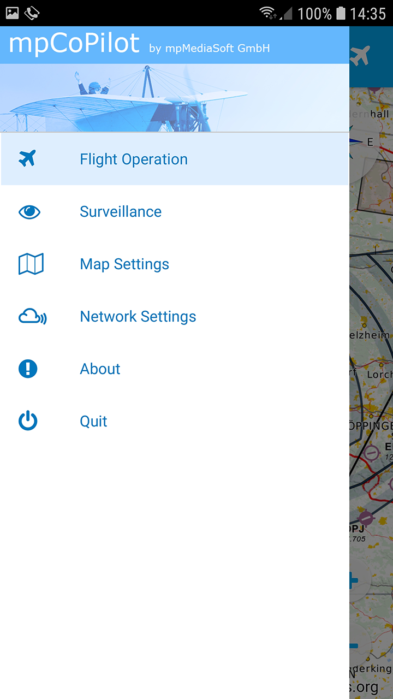
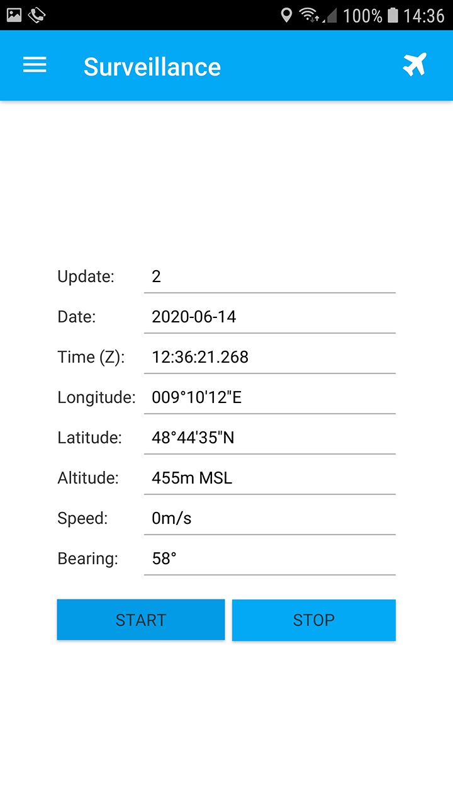
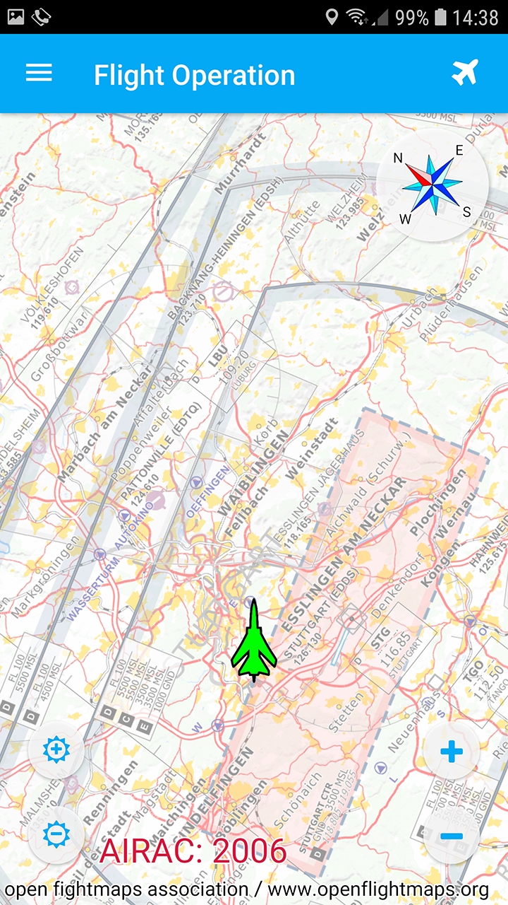

= Building a native, pure JavaFX Android application
Dr.-Ing. Michael Paus, mpMediaSoft GmbH
Version 1.0.0, 2020-06-14
:doctype: article
:encoding: utf-8
:lang: en
:toc: left
:numbered:

[.lead]
A summary of my lessons learned building a first, still simple, pure JavaFX Android
application based on the components of an already existing JavaFX application using
the Gluon Client Maven plugin which is based on the GraalVM `native-image` toolchain.

== Overview

First of all I would like to thank the team at Gluon again which made all the following possible.
Without their continuous, hard work it would not be possible at all to compile a modern
JavaFX application into a native Android application.
My thanks of course also include all the people involved in the GraalVM project
which laid the foundation for the work done for JavaFX by Gluon.

This article summarizes the experiences which I collected while converting one of my
existing Java applications to a native Android application using the Gluon Client Maven plugin.
The application is still relatively small and manageable but otherwise a real-world application
with a lot of external dependencies and technical challenges. It was not always
an easy ride but in the end it worked out nicely.

== The application

[.float-group]
--
[.left]
.Welcome screen in portrait mode.

This is the initial welcome screen which also serves the purpose of an about screen.

Two variants of this screen had to be provided so that it looks nice in portrait as well
as in landscape mode. The switching between the two can then be done easily in standard JavaFX.
--

[.float-group]
--
[.left]
.Welcome screen in landscape mode.

--

[.float-group]
--
[.left]
.Map.

This is the normal map mode. You can navigate the map with the usual
gestures (scroll, zoom and rotate).

The map display is written in pure JavaFx and is identical to the one
used on desktop with the regular Java VM. For better performance it
makes even use of some 3D features which also work nicely on Android.
--

[.float-group]
--
[.left]
.Menu.

Via the menu you can reach several other pages.
--

[.float-group]
--
[.left]
.Location tracking.

On this page you can activate tracking. It takes the position data from
the built-in GPS and sends it via MQTT to a public MQTT-Server.

In this case I had to implement my own Position-Service because the
existing one does not provide all the data I need, e.g., the precise
time stamp and also speed and bearing. My service is just an extension of
the existing one, so doing this was not a big deal.

The MQTT-Client is just the standard Eclipse Paho Client out of the box.
--

[.float-group]
--
[.left]
.Location and orientation on map.

When you go back to the map while tracking is activated, the map will show
an own-ship symbol and will be rotated according to the current bearing
(track-up mode).
--

== Software

=== Libraries

This first, still relatively simple application already uses several external libraries
which can all be used in their standard implemenation right from the Maven repository.
No special Android version is needed.

* slf4j
* ikonli
* paho
* jackson
* miglayout
* commons-io
* commons-lang3
* commons-math3
* earth-gravitatinal-model
* GeographicLib
* plus all the JavaFX-specific libraries from OpenJFX/Gluon

=== Development

The build step still takes a long time. For this project, on my Intel NUC with Ubuntu 20.04,
a build takes about 4-5 minutes. This isn't nice but it also isn't a big problem because
you do not have to go through this all the time. I currently use a development style
where I do all development and testing on my preferred platform (macOS) with the regular
Java VM. This works because the GUI is all pure JavaFX and even the mobile specific controls
work on desktop. Therefore you do not even need any emulator because you can just work
in your preferred development environment. When I am ready with some funtionality I synchronize
the NUC with the GIT repository and start a build for Android, so that I can test it on a real
device.

== Conclusion

This is only a snapshot of my experiences so far in getting a JavaFX
application compiled into a native Android application.
The resulting binary seems to be
very stable and the performance is also quite good. All in all we seem to be on
a very good track here.
