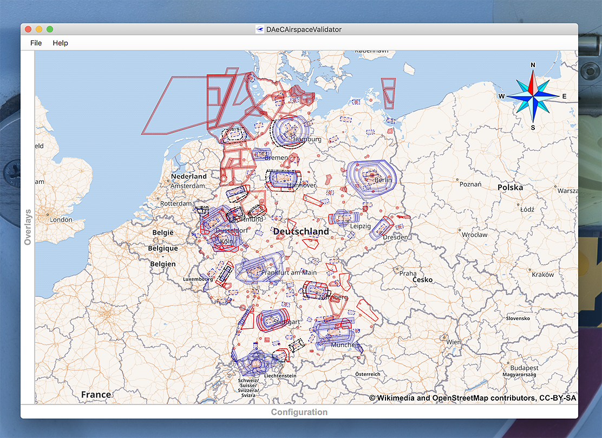

= Building native, AOT compiled, real-world JavaFX applications
Dr.-Ing. Michael Paus, mpMediaSoft GmbH
Version 1.0.3, 2020-02-12
:doctype: article
:encoding: utf-8
:lang: en
:toc: left
:numbered:

[.lead]
A summary of my lessons learned converting an existing JavaFX application to a native,
AOT compiled, real-world application using the Gluon Client Maven plugin which is based
on the GraalVM `native-image` toolchain.

== Overview

First of all I would like to thank the team at Gluon which made all the following possible.
Without their continuous, hard work it would not be possible at all to compile a modern
JavaFX application into a native platform application.
My thanks of course also include all the people involved in the GraalVM project
which laid the foundation for the work done for JavaFX by Gluon.

This article summarizes the experiences which I collected while converting one of my
existing Java applications to a native application using the Gluon Client Maven plugin.
This is not one of the many demos you can find on the internet, but an application that
is still relatively small and manageable but otherwise a real-world application
with a lot of external dependencies and technical challenges. It was not always
an easy ride but in the end it worked out nicely.

Actually this exercise was just the prelude to the real goal which is to also run this,
and other similar applications, on mobile platforms like iOS and Android. (My
main target is Android though, just because I own an Android phone and tablet but
not any iOS device.) Now that the first step has been taken, I now eagerly await
the general availability of the Android support of course.

.Screenshot of the application on the Mac.

== Requirements

Just follow the instructions given on the project page at GitHub.
https://github.com/gluonhq/client-maven-plugin
Further documentation and some samples can be reached from this entry page too.
There is also a Gradle plugin, but at the moment the focus of the development seems
to be on the Maven plugin.

== Build infrastructure

The GraalVM `native-image` tool is very memory hungry. When your build times get longer
and longer, you are probably running out of memory. My initial hello-world builds were
mostly finished within 2 - 4 minutes but when I started to do bigger builds the times
went up to 7, 22 and finally more than an hour. This turned out to be caused
by the insuffcient amount of RAM in my old MacBook Pro, which only had 8 GB of RAM.
Now I use a Mac mini with 16 GB of RAM and my build times, even for larger projects,
are back in the 3 minutes range. So, using a development machine with enough memory
is essential and having even 32 GB of RAM available certainly does not hurt.

Having a fast multi-core CPU also does not hurt. I have seen CPU utilizations of up to
1200%, which is probably the best you can get from a 6 core CPU with hyperthreading.

== Build configuration

=== Options

It is advisable to use the following `native-image` options for the build:

* -ea
* --verbose

The option `-ea` enables assertions in the resulting image and this is very helpful.
It is not as easy as in Java to debug a native image and therefore it is helpful to use
a lot of assertions in your code to be notified as early as possible about potential
problems, e.g., resources which have not been loaded.

The option `--verbose` makes the output of the build process more verbose and this helps in
case something goes wrong. As a build takes a while, it makes sense to always use this option
so that you do not have to repeat the build in case something goes wrong and you don't know why.

=== System properties

When calling `native-image` you can define system properties but these are only
visible to the VM during the build process but not later at run-time of the native
application. This can cause some confusion because for classes which are initialized
at build-time, these system properties would be defined, whereas for classes which are
initialized at run-time they wouldn't.

A concept, how they can be made visible at run-time too, is explained here
https://github.com/oracle/graal/issues/779 but this does not seem to work anymore
because classes are now initialized at run-time by default and not at build-time
as in previous versions. In order to circumvent this problem I created a separate
class for this and defined via the appropriate command line option `--initialize-at-build-time` that this
particular class should be initialized at build time. This did the trick and it works now.

NOTE: Don't try to be too smart when writing this class. Only write primitive code because
otherwise `native-image` will refuse to initialize this class at build-time.

== GraalVM/native-image limitations

GraalVM `native-image` still has several limitations which may bite you in real-world
projects. So I strongly advise you to read the following document which
summarizes most of these limitations.

https://github.com/oracle/graal/blob/master/substratevm/LIMITATIONS.md

The ones I stumbled over most often where:

* Reflection configuration (Everywhere)
* Method Handles not supported (Log4J, NSMenuFX)
* Serialization not supported (Disk cache)
* Soft-References not working as expected (RAM cache)

I'll go into more details in the following sections.

=== Reflection

The use of reflection is ubiquitous in the Java world which poses a problem for any AOT
(ahead of time) compilation of Java code because which classes are accessed via reflection
is not always known at build time. Some uses can be detected automatically but for others
a list of classes must be provided by the user at build time.

One way to make this task less tedious and error prone, is to use the tracing agent.

https://medium.com/graalvm/introducing-the-tracing-agent-simplifying-graalvm-native-image-configuration-c3b56c486271

This agent collects relevant data by analyzing the software when executed via a standard
Java virtual machine. It's a pitty though that the output of this agent cannot yet be integrated
directly into the configuration of the client-maven-plugin.

See: https://github.com/gluonhq/client-gradle-plugin/issues/25

=== Resources

Resources can be delt with in a similar way as reflection. The nice thing is that you can
specify which resources to load via wild cards. In my case it was enough to specify the
following resource list:
....
<resourcesList>
    <list>.*\\.properties$</list>
    <list>.*\\.vert$</list>
    <list>.*\\.wav$</list>
    <list>.*\\.json$</list>
    <list>.*\\.COF$</list>
</resourcesList>
....
A special case of this are language resource bundles which are also properties but have to
be specified in a separate list. It would be very tedious if you would have to explicitly
differentiate between general properties and language bundles but in my case I found it
to be ok to keep the properties wild card in the resource list and separately add the
language bundles to the bundles list like this.
....
<bundlesList>
    <list>com.mycompany.myproject.Main</list>
    <list>com.mycompany.myproject.airspaces.Airspaces</list>
    <list>com.mycompany.myproject.maps.Maps</list>
    <list>controlsfx</list>
</bundlesList>
....

=== Method handles

According to the documentation, method handles are not supported.

See: https://github.com/oracle/graal/blob/master/substratevm/LIMITATIONS.md#invokedynamic-bytecode-and-method-handles

This has severe consequences for several libraries and frameworks.

==== Logging

Logging frameworks are notorious users of all kind of reflection magic (I still don't understand why) which
falls onto your feet when you use `native-image`. The worst of all is Log4J.

See: https://issues.apache.org/jira/browse/LOG4J2-2649?focusedCommentId=17005296&page=com.atlassian.jira.plugin.system.issuetabpanels:comment-tabpanel#comment-17005296

I finally had to completely abandon Log4J (and in retrospect I wonder why I have ever used it at all).
This switch was made easy for me by the fact that I have consistently used the SLF4J facade throughout all my
software, so the only necessary change was the configuration of the logging framework and rewriting my own
JFX logging handler. I finally ended up using the standard Java logging because that is supported out of the
box with `native-image`. The simple variant of SLF4J also worked but it would have been more complicated to
rewrite my JFX logging handler.

==== NSMenuFX

Another library I used was NSMenuFX to get a decent system menu integration for the Mac, which JavaFX
does not provide by default, but it failed with `native-image`. After a lot of research
(thanks José https://github.com/gluonhq/substrate/issues/118 ) I finally learned that this is also due
to the internal use of method handles.

So I first created an issue https://github.com/codecentric/NSMenuFX/issues/31 on GitHub and
finally fixed the problem myself and created a pull-request, which has now been integrated into the
latest release of NSMenuFX. 

However, my frustration grew again when I finally realized that this was all in vain and NSMenuFX still
did not work because the system menu bar is in general not yet supported. This isn't nice for the Mac version
but as my real goal is the Android version it is not such a big problem because on Android I won't need the
system menu bar anyway.

=== Serialization

I used Java serialization for a temporary disk cache but serialization is currently not
supported. So I now have to live without disk cache. (The issue was not serious enough
to justify a switch to another fast serialization technique.)

https://github.com/oracle/graal/blob/master/substratevm/LIMITATIONS.md#serialization

=== Soft references

I used a temporary RAM cache in my code which was based on Javas soft-references.
The result was that my native code felt slow and was not very responsive and I was
actually very disappointed. Finally I found out that this happened because my cache
was almost always empty and so my software had to load everything from disk over and over
again. GraalVMs `native-image` handles references differently than the Java VM does, which
has the effect that all soft-references are always immediately cleared and thus became
useless to me.

https://github.com/oracle/graal/blob/master/substratevm/LIMITATIONS.md#references

There is only one small sentence in the documentation which hints at this deviation.

NOTE: I learned from Laurent Bourgès that the MarlinFX renderer uses soft-references
by default to hold its own renderer context. It should therefore be tuned for
GraalVM `native-image` to use hard references instead: `-Dprism.marlin.useRef=hard`

=== Single locale

A severe, not very well documented, limitation of `native-image` is the fact that
currently only one locale  is supported. You have to decide at build time which locale
you want to use for your application. If you want to support more than one locale you
have to build separate versions of your application. One for each supported locale.

This is already a pain but it gets worse if you look at the possible side effects
this can have. In fact you cannot even parse a simple string value which does not
adhere to the conventions of your chosen built-in locale.

See: https://github.com/oracle/graal/issues/2141

== JavaFX/Native limitations

The JavaFX part of the native image creation currently also has some limitations.

=== System menus

The system menu bar is currently not supported (see above).

=== AWT

AWT is currently not supported. This would not be such a big deal if some features
of JavaFX did not depend on it.

* Image IO.
* javafx.application.HostServices.showDocument (fails on Mac)

It would probably be a good idea in general to make JavaFX completely independent
from AWT.

=== Audio

Playing AudioClips currently does not seem to work because the glib-lite library is missing.

See: https://github.com/gluonhq/substrate/issues/336

=== Image size

The size of the created executable file currently seems to be quite big. In my case, of a still
quite small application, the size is already 94 MB which is more than the whole
.app bundle created by jpackage which has only 69.3 MB.

== Open issues

Besides all the issues mentioned above I still have to get SQLite working for the next
steps. But this is still work in progress.

== Conclusion

This is only a snapshot of my experiences so far in getting a real-world JavaFX
application compiled into a native image. If I have missed something important or you think
you can help me with one of the open issues, just drop me a line or create an issue here.

Once you have circumvented all the mentioned problems, the resulting binary seems to be
quite stable and the performance is also very good. So, I am looking forward to do the next
step and compile the whole application as an Android app.